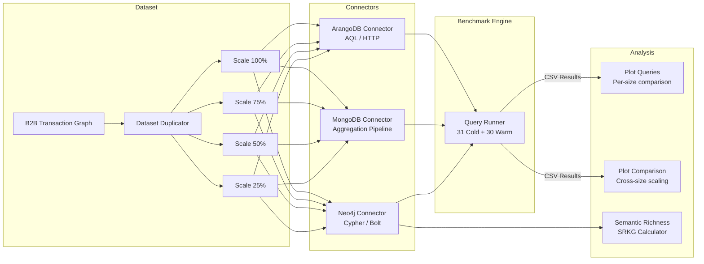
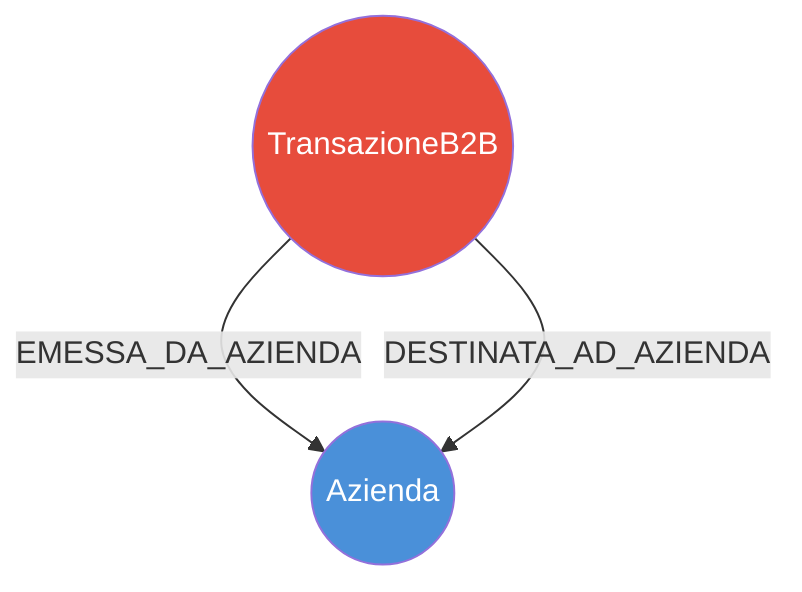

<p align="center">
  <h1 align="center">🔬 Big Data Logical Scalability</h1>
  <p align="center">
    <strong>Multi-DBMS Performance Benchmark for Logical Model Scalability Analysis</strong>
  </p>
  <p align="center">
    
    
    
    
    
  </p>
</p>

---

## 📖 Overview

This project provides a **rigorous, reproducible benchmark framework** for evaluating how different database management systems handle graph-oriented queries at increasing data scales. The study compares three popular DBMS paradigms:

| DBMS | Paradigm | Query Language |
|------|----------|----------------|
| **Neo4j** | Native Graph | Cypher |
| **MongoDB** | Document Store | Aggregation Pipeline |
| **ArangoDB** | Multi-Model (Document + Graph) | AQL |

The benchmark uses a **B2B transaction graph** and evaluates performance across **4 query complexity levels** and **4 dataset scale factors** (25%, 50%, 75%, 100%), measuring both **cold-start** and **warm-cache** execution times.

---

## 🏗️ Architecture



---

## 📊 Dataset — B2B Transaction Graph

The benchmark uses a **B2B (Business-to-Business) transaction graph** modeled as a knowledge graph with companies and their financial transactions:



> **Node types**: `Azienda` (Company), `TransazioneB2B` (B2B Transaction)  
> **Relationship types**: `EMESSA_DA_AZIENDA` (issued by), `DESTINATA_AD_AZIENDA` (sent to)  
> **Transaction properties**: `importo_eur`, `aliquota_iva`, `data_emissione`, `id_transazione`

The dataset is scaled using a **duplication strategy** that clones nodes and relationships to create 4 progressively larger versions (25%, 50%, 75%, 100%).

---

## 🧪 Benchmark Queries

The benchmark evaluates 4 query types of **increasing complexity**, designed to stress different aspects of each DBMS:

| # | Query Type | Complexity | Hops | Description |
|---|-----------|-----------|------|-------------|
| **Q1** | Complex Scan | 🟢 Low | 0 | Multi-filter scan on a single entity (range filters on amount, VAT, dates) |
| **Q2** | Join | 🟡 Medium | 1 | 1-hop join between two entity types (Company → Transaction) |
| **Q3** | Short Chain | 🟠 High | 2 | 2-hop graph traversal (Company → Transaction → Company) |
| **Q4** | Deep Chain | 🔴 Very High | 4 | 4-hop deep traversal with limits (multi-hop path exploration) |

> **Design rationale**: Q1 favors document stores (MongoDB), Q3-Q4 favor native graph databases (Neo4j), while Q2 is a transitional workload.

---

## 📐 Methodology

Each query is executed under two conditions to capture different performance profiles:

### Cold Run (31 iterations)
- **Connect → Execute → Disconnect** for each iteration
- Measures: startup cost, cache miss penalty, connection overhead
- First iteration discarded as a "warm-up"

### Warm Run (30 iterations)
- **Single connection** maintained across all iterations
- Measures: steady-state performance, cache-hit latency
- Captures the DBMS's optimal throughput

All timings are **client-side** (`time.perf_counter()`), measured from query submission to result consumption, ensuring a fair cross-DBMS comparison.

### Statistical Analysis
- **Mean** execution time per query
- **95% Confidence Intervals** using Student's t-distribution
- Results exported as CSV for reproducibility

---

## 📁 Project Structure

```
big-data-logical-scalability/
│
├── main.py                         # 🚀 Main benchmark orchestrator
├── query_runner.py                 # ⏱️ Cold/warm execution engine
│
├── neo4j_connector.py              # 🔵 Neo4j connection & query execution
├── mongodb_connector.py            # 🟢 MongoDB connection & query execution
├── arangodb_connector.py           # 🟡 ArangoDB connection & query execution
│
├── plot_queries.py                 # 📊 Per-dataset-size bar charts
├── plot_comparison.py              # 📈 Cross-size scaling comparison (log scale)
├── semantic_richness_calculation.py # 🧮 SRKG semantic richness metric
│
├── dbms_converter/
│   ├── dataset_duplicator.py       # 🔄 Dataset scaling via node/edge cloning
│   ├── neo4j_to_arango_export.py   # ➡️ Neo4j → ArangoDB data migration
│   ├── neo4j_to_mongo_export.py    # ➡️ Neo4j → MongoDB data migration
│   └── export_csv/                 # 📋 Exported CSV files for each entity
│
├── 25/ 50/ 75/ 100/                # 📂 Benchmark results per scale factor
│   └── {dbms}_query{N}_{dbms}_{mode}.csv
│
├── results/                        # 🖼️ Generated plots
│   ├── query{N}_{cold|warm}.png
│   └── ...
│
├── requirements.txt
├── .env.example
└── README.md
```

---

## ⚙️ Prerequisites

Ensure the following services are installed and running:

| Service | Version | Default Port |
|---------|---------|-------------|
| **Python** | ≥ 3.10 | — |
| **Neo4j** | ≥ 4.x | `bolt://localhost:7687` |
| **MongoDB** | ≥ 6.x | `mongodb://localhost:27017` |
| **ArangoDB** | ≥ 3.x | `http://localhost:8529` |

---

## 🚀 Installation

### 1. Clone the repository

```bash
git clone https://github.com/rosarionapoli99/big-data-logical-scalability.git
cd big-data-logical-scalability
```

### 2. Create a virtual environment

```bash
python -m venv venv

# Windows
venv\Scripts\activate

# macOS/Linux
source venv/bin/activate
```

### 3. Install dependencies

```bash
pip install -r requirements.txt
```

### 4. Load the dataset into Neo4j

Load your B2B transaction graph into Neo4j using the Neo4j Browser, `neo4j-admin`, or any preferred import method. The graph should contain `Azienda` and `TransazioneB2B` nodes with the relationships `EMESSA_DA_AZIENDA` and `DESTINATA_AD_AZIENDA`.

### 5. Configure database connections

Copy the example environment file and edit it with your credentials:

```bash
cp .env.example .env
```

> ⚠️ The connection parameters are currently hardcoded in `main.py`. Update them to match your local setup.

### 6. Migrate data to MongoDB and ArangoDB

```bash
# Export from Neo4j to MongoDB
python dbms_converter/neo4j_to_mongo_export.py

# Export from Neo4j to ArangoDB
python dbms_converter/neo4j_to_arango_export.py
```

### 7. Scale the dataset (optional)

```bash
# Duplicate dataset to increase scale factor
python dbms_converter/dataset_duplicator.py
```

---

## ▶️ Usage

### Run the full benchmark

```bash
python main.py
```

This will execute all 4 queries on all 3 DBMS with 31 cold runs and 30 warm runs each. Output CSV files are saved in the current directory.

### Generate performance plots

```bash
# Per-size comparison (single dataset size)
python plot_queries.py

# Cross-size scaling comparison (all sizes)
python plot_comparison.py
```

### Calculate Semantic Richness (SRKG)

```bash
python semantic_richness_calculation.py
```

---

## 📈 Results

After running the benchmark, plots are generated in the `results/` directory:

| Plot Type | Description |
|-----------|-------------|
| `queryN_cold.png` | Cold-start performance per query |
| `queryN_warm.png` | Warm-cache performance per query |
| `queryN_comparison_cold_log.png` | Cross-size scaling (log scale) |

> **Key Findings**: Graph databases (Neo4j, ArangoDB) excel at multi-hop traversals (Q3, Q4), while MongoDB performs competitively on scan-heavy workloads (Q1) due to its optimized document scanning engine.

---

## 🧮 Semantic Richness Metric

The **SRKG (Semantic Richness of Knowledge Graphs)** metric quantifies the structural complexity of the knowledge graph:

$$SRKG = \alpha \cdot D_{types} + \beta \cdot H_C + \gamma \cdot H_R$$

Where:
- **D_types** = Diversity of node and relationship types (log-based)
- **H_C** = Shannon entropy of node type distribution
- **H_R** = Shannon entropy of relationship type distribution
- **α, β, γ** = Weighting parameters (default: 1)

---

## 🤝 Contributing

Contributions are welcome! Please feel free to submit a Pull Request.

1. Fork the repository
2. Create your feature branch (`git checkout -b feature/amazing-feature`)
3. Commit your changes (`git commit -m 'Add amazing feature'`)
4. Push to the branch (`git push origin feature/amazing-feature`)
5. Open a Pull Request

---

## 📄 License

This project is licensed under the **MIT License** — see the [LICENSE](LICENSE) file for details.

---

## 📬 Contact

For questions, suggestions, or collaboration opportunities, please open an [issue](https://github.com/<your-username>/big-data-logical-scalability/issues).

---

<p align="center">
  Made with ❤️ for Big Data Research
</p>
